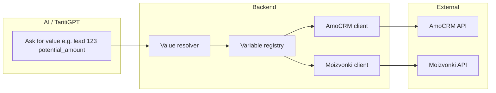

# Backend-driven AmoCRM & Moizvonki value layer and debug page

## Current problems

- **AmoCRM / Moizvonki tools** ([backend/src/lib/ai/tools/amocrm.ts](backend/src/lib/ai/tools/amocrm.ts), [backend/src/lib/ai/tools/moizvonki.ts](backend/src/lib/ai/tools/moizvonki.ts)) expose raw HTTP: the AI must know paths, methods, and body shapes for poorly documented APIs.
- **Moizvonki implementation is wrong**: the code uses GET/POST to arbitrary endpoints (e.g. `/users/me`), but the [Moizvonki API](https://www.moizvonki.ru/guide/api/) is a **single POST** to `https://[domain].moizvonki.ru/api/v1` with a JSON body containing `user_name`, `api_key`, `action` (e.g. `calls.list`, `calls.make_call`, `company.list_employee`), and action-specific parameters. No GET or path-based routing.
- **No abstraction**: the AI has to construct requests instead of asking for “what value do I need”.

---

## Target architecture

- **AI** only specifies **what** it wants (e.g. “deal 456 budget”, “calls in last 7 days”).
- **Backend** holds the registry of possible variables, resolves references to concrete API calls, runs them, and returns typed values (or clear errors).

---

## 1. Variable reference format

Support both **static** and **dynamic** references.

- **Static** (no entity id): e.g. `amocrm.pipelines`, `moizvonki.calls_list`, `amocrm.account`.
- **Dynamic** (entity + id + optional field): e.g. `amocrm.lead(123)`, `amocrm.lead(123).potential_amount`, `amocrm.contact(456).name`.

Proposed request shape from the AI tool (single tool to “get value”):

- **Option A – path string**: `get_external_value({ path: "amocrm.lead(123).potential_amount" })`.
- **Option B – structured**: `get_external_value({ source: "amocrm", entity: "lead", id: "123", field: "potential_amount" })`.

Recommend **Option A** for brevity in prompts; backend parses the path and validates against the registry. Support both in the backend (path parser normalizes to structured form).

**Conventions:**

- `source`: `amocrm` | `moizvonki`
- `entity`: e.g. `lead`, `contact`, `pipeline`, `calls`, `sms_templates`
- `id`: required only for entity instances (e.g. lead id, contact id)
- `field`: optional; if omitted, return the full entity object.

---

## 2. Variable registry (single source of truth)

Add a **variable registry** that defines every value the AI can request.

- **Location**: e.g. [backend/src/lib/external-api/registry.ts](backend/src/lib/external-api/registry.ts) (new module).
- **Structure per variable**:  
`id` (e.g. `amocrm.lead.potential_amount`), `description`, `source`, `entity`, `requiredParams` (e.g. `leadId`), `optionalParams` (e.g. date range), `resolver` key or function reference, and **static list of all variables** for the debug UI and system prompt.

**AmoCRM variables (examples from [docs](docs/API docs/amocrm) and [amocrm.ru](https://www.amocrm.ru/developers/content/integrations/intro)):**

- Static: `amocrm.account`, `amocrm.pipelines`, `amocrm.leads_list`, `amocrm.contacts_list`, `amocrm.users`, etc.
- Dynamic: `amocrm.lead({id}).*`, `amocrm.contact({id}).*`, `amocrm.company({id}).*` — backend maps to GET `/api/v4/leads/:id`, `/api/v4/contacts/:id`, etc., and optionally to a specific field (e.g. `potential_amount`).

**Moizvonki variables (from [API - REST](docs/API docs/moizvonki/API - REST.html) and [moizvonki.ru](https://www.moizvonki.ru/guide/api/)):**

- All requests go to **one** POST endpoint; body: `user_name`, `api_key`, `action` + params.
- Static: `moizvonki.calls_list` (action `calls.list` with `from_id: 0` or date range), `moizvonki.sms_templates` (`calls.get_sms_templates`), `moizvonki.employees` (`company.list_employee`), `moizvonki.groups` (`company.list_group`).
- Optional params: e.g. `from_date`, `to_date`, `max_results`, `supervised` for `calls.list`.
- Dynamic (if needed): e.g. “calls for user X” via params, not path.

Registry entries should include:

- Human-readable **description** (for AI and debug page).
- **Example path** and **example request/response** (for debug “all possible variables” and testing).

---

## 3. Backend implementation

### 3.1 Fix Moizvonki client

- **New client**: [backend/src/lib/external-api/moizvonki.ts](backend/src/lib/external-api/moizvonki.ts).
- Single method: POST to `https://${domain}.moizvonki.ru/api/v1` (domain from env, e.g. `MOIZVONKI_DOMAIN` or derived from existing env) with body `{ user_name, api_key, action, ...params }`.
- Wrap `calls.list`, `calls.make_call`, `calls.send_sms`, `calls.get_sms_templates`, `company.list_employee`, `company.list_group`, and webhook subscribe/unsubscribe/list as typed helpers if needed; the **value layer** will call these based on registry.

### 3.2 AmoCRM client

- **New or refactored client**: [backend/src/lib/external-api/amocrm.ts](backend/src/lib/external-api/amocrm.ts).
- Use existing env `AMOCRM_BASE_URL`, `AMOCRM_API_KEY`; implement GET/POST/PATCH to `/api/v4/*` (account, leads, contacts, pipelines, etc.) as needed by the registry.

### 3.3 Value resolver

- **New**: [backend/src/lib/external-api/resolver.ts](backend/src/lib/external-api/resolver.ts).
- Input: parsed reference (path string or structured).
- Logic: lookup in registry → get resolver key → call appropriate client method with params (from path or from optional tool args, e.g. date range).
- Output: `{ success, value?, error? }` (normalized shape for the AI).

### 3.4 New AI tool: `get_external_value`

- **Replace** (or deprecate) `call_amocrm_api` and `call_moizvonki_api` with a single tool, e.g. `get_external_value`.
- **Input**:  
  - `path` (string): e.g. `amocrm.lead(123).potential_amount`, or  
  - `source`, `entity`, `id?`, `field?`, and optional `params` (e.g. `from_date`, `to_date` for Moizvonki).
- **Output**: resolved value (or error with reason).
- **System prompt**: update to describe “ask for values by path; use the variable registry / debug page to see all possible variables”. Optionally inject a short list of the most used variable paths into the prompt.

### 3.5 Backend API for debug and listing

- **GET** `/api/external-api/variables` — returns the full list of variables from the registry (id, description, example path, required/optional params, source). Used by the debug page to show “all possible variables”.
- **POST** `/api/external-api/resolve` — body: `{ path }` or structured reference + optional params. Runs the resolver and returns `{ success, value, error }`. Auth: same as dev (e.g. require auth + developer mode optional for extra safety). Used by the debug page to “test” a variable and show live value.

---

## 4. Debug page: “All possible variables”

- **Page**: extend or replace the current “External API testing” ([frontend/src/pages/dev/DevApiPage.tsx](frontend/src/pages/dev/DevApiPage.tsx)) with a **Variables**-first view.
- **Content**:
  - **Section 1 – List of all variables**: Table or cards of every registry variable: id, description, example path, required/optional params. Group by source (AmoCRM / Moizvonki) and by entity/static vs dynamic.
  - **Section 2 – Test a variable**: Input for path (or structured form). “Resolve” button calls `POST /api/external-api/resolve`. Display result (value or error). Optional: show raw request/response for the underlying API call (if you add a debug flag).
  - **Section 3 (optional) – Raw API**: Keep a collapsible “Raw AmoCRM / Moizvonki” panel for power users (current behavior: AmoCRM = method + path + body; Moizvonki = single POST with `action` + params in body). For Moizvonki, fix the UI to send a single POST with `action` and params instead of method + endpoint.
- **Data**: On load, fetch `GET /api/external-api/variables` and cache; use for the list and for autocomplete/hints in the “Test a variable” input.

---

## 5. Features to include

- **Single tool** for the AI: `get_external_value(path, params?)` — no raw HTTP from the AI.
- **Variable registry** with all AmoCRM and Moizvonki values you want to expose (static + dynamic), with descriptions and examples.
- **Static references**: e.g. pipelines, account, calls list, sms templates, employees, groups.
- **Dynamic references**: e.g. `amocrm.lead(123)`, `amocrm.lead(123).potential_amount`, `amocrm.contact(456).name`; backend performs GET by id and optionally returns one field.
- **Moizvonki client** corrected to the documented API (single POST, `action` + params).
- **Debug page** with: (1) list of all possible variables and (2) “resolve” test for any path; optional (3) raw API tester with correct Moizvonki semantics.
- **Errors**: Resolver returns clear messages (e.g. “Variable not in registry”, “AmoCRM returned 401”, “Missing required param: leadId”).

---

## 6. Implementation order (suggested)

1. Add **variable registry** (static list + schema) and **path parser** (path string → structured).
2. Implement **Moizvonki client** (single POST, `action`-based) and **AmoCRM client** (existing fetch logic moved to a dedicated module).
3. Implement **resolver** (registry + clients) and **GET/POST** routes for variables and resolve.
4. Add **get_external_value** tool and wire it to the resolver; update system prompt; deprecate or remove `call_amocrm_api` and `call_moizvonki_api`.
5. **Debug page**: fetch variables, show table, add “Resolve” test; fix Moizvonki raw tester to use `action` + body; optionally keep AmoCRM raw tester.

---

## 7. Files to add or change (summary)

| Area                                                  | Action                                                             |
| ----------------------------------------------------- | ------------------------------------------------------------------ |
| `backend/src/lib/external-api/registry.ts`            | New: variable definitions, list for debug, schema.                 |
| `backend/src/lib/external-api/amocrm.ts`              | New: AmoCRM HTTP client used by resolver.                          |
| `backend/src/lib/external-api/moizvonki.ts`           | New: Moizvonki single-POST client (fix current wrong API usage).   |
| `backend/src/lib/external-api/resolver.ts`            | New: parse path, lookup registry, call client, return value.       |
| `backend/src/lib/external-api/index.ts`               | New: export registry + resolver (and clients if needed).           |
| `backend/src/routes/external-api.ts` (or under `dev`) | New: GET variables, POST resolve.                                  |
| `backend/src/lib/ai/tools/amocrm.ts`                  | Remove or reduce to internal use only.                             |
| `backend/src/lib/ai/tools/moizvonki.ts`               | Remove or reduce to internal use only.                             |
| `backend/src/lib/ai/tools/external-value.ts`          | New: tool `get_external_value` calling resolver.                   |
| `backend/src/lib/ai/tools/index.ts`                   | Register new tool; remove or deprecate old AmoCRM/Moizvonki tools. |
| `backend/src/lib/ai/system-prompt.ts`                 | Document “ask by path”, link to variable list / debug page.        |
| `frontend/src/pages/dev/DevApiPage.tsx`               | Variables list + “Resolve” test; fix Moizvonki raw to action+body. |
| `backend/src/index.ts`                                | Mount new external-api (or dev) routes.                            |

---

## 8. Moizvonki API summary (for implementation)

- **Base URL**: `https://{MOIZVONKI_DOMAIN}.moizvonki.ru/api/v1` (often `app` or a custom subdomain).
- **Method**: POST only; `Content-Type: application/json`.
- **Body**: `user_name`, `api_key`, `action`, plus action-specific params.
- **Actions**: `calls.make_call`, `calls.send_sms`, `calls.get_sms_templates`, `calls.list`, `webhook.subscribe`, `webhook.unsubscribe`, `webhook.list`, `company.list_employee`, `company.list_group`, `company.create_employee`, `company.delete_employee`, `company.activate_employee`.

---

This plan gives you a single “ask for the value you want” flow, correct Moizvonki usage, static and dynamic references, and a debugging page that lists and tests all possible variables.